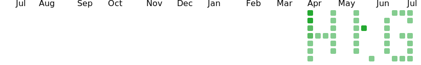

## 草の成長状況監視

### 監視対象
[サブアカウント](https://github.com/kokoichi2)の草。

### [grass.sh](./grass.sh)によって生成される svg

### [yml](../.github/workflows/sub_account-grass-watcher.yml) のなかで imagemagick を使って変換された png

